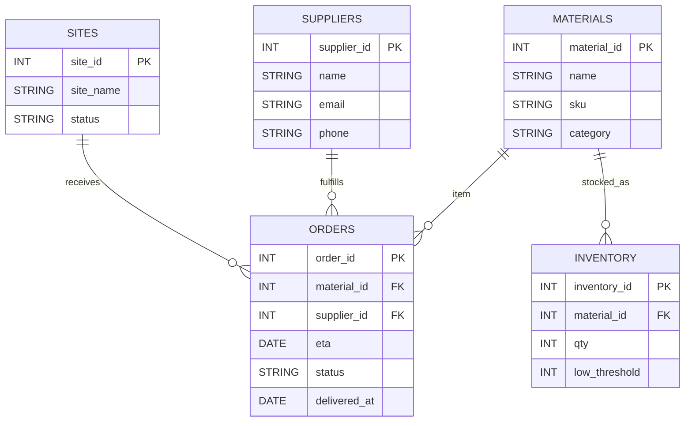

<h1 align = "center" > BFB321 Supply Chain Management Web Application</h1>

<p align = "center" >
  <strong> University of Pretoria • Module BFB321 — Web App Development </strong><br>
  <em> Lightweight browser-based construction supply chain platform </em>
</p>

---

## Overview

The BFB321 Supply Chain Management Web Application improves coordination on construction projects by giving management real time visibility into:

- Material orders and suppliers
- Inventory health (OK / LOW / ORDER)
- Delivery progress and ETAs
- Building sites (Working / WIP)
The application has been fully developed in HTML, Bootstrap, JavaScript and Chart.js and
uses LocalStorage to store data locally for instant and persistent demo use.

---

## System Architecture

| Layer | Technology | Purpose |
|--------|-------------|----------|
| **Frontend** | HTML5, CSS3, Bootstrap 5.3 | Responsive layout, components, forms, tables |
| **Logic Layer** | JavaScript (ES6) | Data management/handling, rendering, charting |
| **Persistence** | LocalStorage | Client-side database emulation |
| **Analytics** | Chart.js v4.4.1 | Live dashboards for inventory, orders, build sites |
| **Optional Backend** | SQLite / Flask | Database schema, server persistence and API integration |

## Pages and there Features

| Page | Description | Main Features |
|------|--------------|----------------|
**`index.html` — Dashboard** | High-level overview of orders, deliveries, and inventory health | KPI cards, "Add Order" modal, Reset/Import/Export data, summary grid
| **`supplier.html` — Supplier Portal** | Supplier-facing interface to manage deliveries | Search/filter orders, update ETA, mark as delivered, report delays
| **`manager.html` — Inventory Control** | Site manager view of stock levels | View inventory, increment/decrement quantities, low/reorder status badges
| **`reports.html` — Analytics** | Data-driven visualization layer | 3 live charts: Buildings (Working/WIP), Inventory Health, and Deliveries by Status |

For easy user movement between modules, every page has the same design theme and navigation bar.

---

## How It Works (Steps)

### Data Layer

All information (orders, suppliers, inventory, and sites) is seeded and stored in **LocalStorage** against the key `bfb_supply_data_v1`.
When any page is opened, the app:

- Requests the data from LocalStorage (or seeds default data if empty),
- Renders the KPIs and table dynamically,
- Saves all changes automatically (for example, deliveries being marked or stocking numbers are updated).

### Examples of Interaction

- **Add Order:** Click *“Add Order”* → enter the material, supplier, ETA, and status → dashboard and reports update immediately.
- **Report Delay:** On *Supplier Portal* click *“Report Delay”* → enter reason for delay and new ETA → record updates real-time across system.
- **Adjust Stock:** On *Manager Page*, click `+` or `–` → adjusts quantity and colour status (OK / Low / Reorder).
- **Reports:** Graphs auto-refresh between tabs by way of lightweight polling.

### Visualisation

`app.js` uses Chart.js to summate:

- **Buildings**: Working versus WIP Sites
- **Health of Inventory**: OK / Low / Reorder ratio
- **Deliveries**: Scheduled / In Transit / Delayed / Delivered
Charts are updated dynamically whenever the orders or inventory changes, ensuring that the complete supply chain is updated instantly.

# DeWalt Construction Supply Chain

This Website project examines the following supply chain processes directly in the construction environment of DeWalt Construction:

| Process | Digital Representation |
|----------|----------------------|
|Procurement | Order creation and scheduling with supplier’s name & ETA |
| Coordination of suppliers | Reporting on delays, updates of ETA, confirmation of delivery. |
| Inventory management | Dynamic stock visibility with stock thresholds |
| Tracking of logistics | Flow of order through statuses: Scheduled → In Transit → Delivered |
| Analytics | Performance trends for stock health and delivery progress. |

These processes mentioned above addresses the issues of visibility and the communication observed in the supply chain of DeWalt Construction and apply the best supply chain practice.

## File Structure

```text
git-BFB_Project
 ┣  index.html         → Dashboard
 ┣  supplier.html      → Orders
 ┣  manager.html       → Inventory
 ┣  reports.html       → Charts & Reports
 ┣  app.js             → App logic
 ┣  style.css          → Custom dark theme styling
 ┣  schema.sql         → Database schema (optional backend)
 ┗  README.md          → Documentation

 ```

## Data Model (ERD)



## How to run locally

Just run any HTML file in a browser, no install necessary.

### First Method: Direct Run

1. Get the repository via download or clone.
2. Launch your browser and go to `index.html`.
3. Use LocalStorage to execute the dashboard egg, all changes are saved by default.

### Method #2: Use the Live Server (recommended)

```bash # Example of use in VS Code, right click the index.html and click "Open with Live Server"```

## The Database Schema(Future Backend)

Normalized tables in the database are five core tables:

- sites (site name, site id, status)
- suppliers (name, email, phone, supplier id)
- materials (name, sku, category, material id)
- inventory (material id, quantity, low threshold, site id, inventory id)
- orders (order id, material id, supplier id, site id, eta, status, delivered at, delay reason)  

The referential integrity of the foreign keys (and also the timestamps which include - - - created at, and updated at) is assured.  
Indexes (like the indexes for the supplier name, sku, status, eta) are defined for performance improvement on the frequently looked up things.

## Sustainability & Impact

This web-based application demonstrates how a responsive and browser-based application can
support better coordination and visibility of a construction supply chain. The combination
of orders, stock signals (OK/Low/Reorder), and delivery status in a single interface
removes delays associated with miscommunication and manual follow-up and prevents stock out
situations of too much or too little stock. The design is highly scalable even if the
frontend is responsive and device-friendly such that it can be used in the field.
Multi-site and role-specific access is represented by a small backend in SQLite/MySQL
(BDC schema included). It is this structure which ultimately allows for sensors to be
incorporated into stock, alerts to be scheduled and ETA risks to be alerted to users for
proactive and sustainable operational planning.

## Future Improvements and Development Ideas

This prototype serves as a basis for a complete
system that works as a proof of concept. There are many future stages of development, of
which some are detailed on the future development stages below:

1. Backend integration(SQLite / MySQL + Flask)

- Creation of REST API endpoints for inventories, suppliers and
orders.
- Role Based Access Control (manager vs supplier) User authentication management

2. Tracking, Sync & Notification in Real-Time

- The use of a live database (rather than local
storage) for real-time status updates via WebSocket.

3. Access Control + User Management

- For managers and suppliers of sites to register and login. Role-based dashboards.

4. Advanced Analytics

- Involving time-series predictive analytics in diverging usability trends of
materials / times of delivery delays.
- Export of analytics reports and data in CSV / PDF format.
-

5. IoT & Sustainability

- Integration of IoT sensors for Smart auto insertion for inventory monitoring.
- Implementation of predictive analytics for ETA forecasting and stock reordering.
-

6. Deployment plan

- For front-end through GitHub Pages and back-end API via Render/Heroku.
